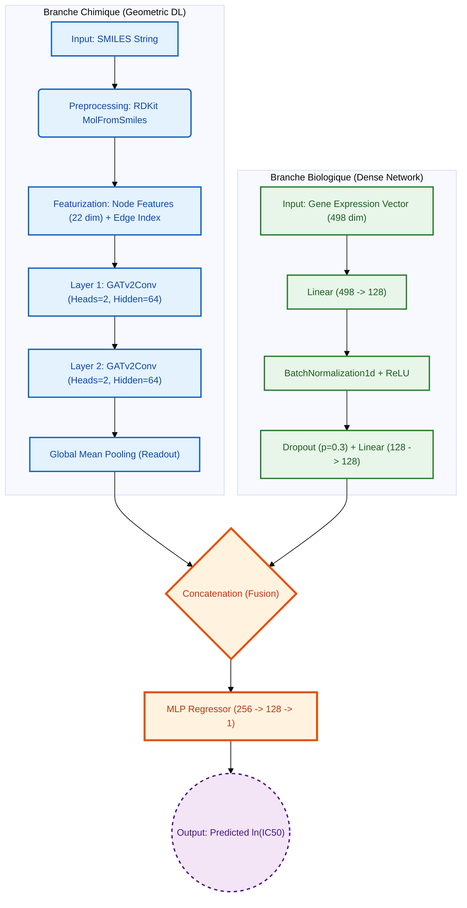
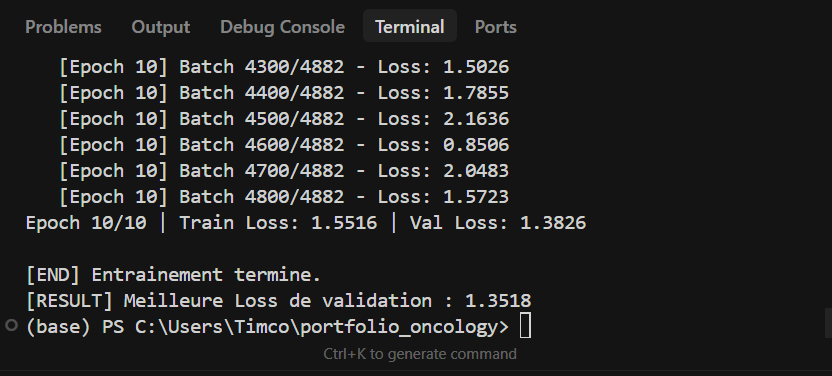
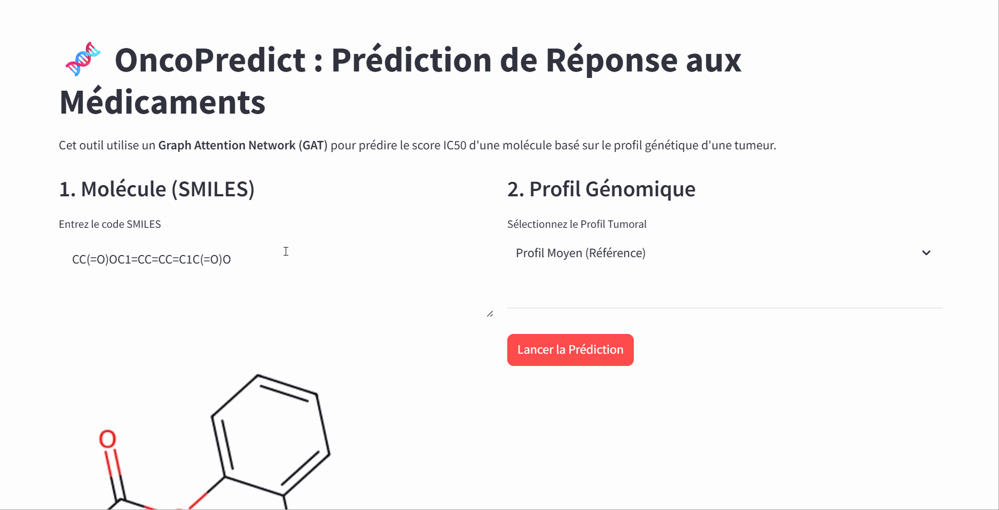

# OncoPredict : Deep Learning for Drug Response Prediction

<div align="center">


**Framework de prédiction *in-silico* de l'efficacité médicamenteuse ($IC_{50}$) par fusion multimodale (Graphes Moléculaires + Transcriptomique).**

[Architecture](#architecture-du-modele) • [Ingénierie des Données](#pipeline-etl--featurization) • [Installation](#installation-et-utilisation)

</div>

---

## Contexte Scientifique & Problématique

La découverte de médicaments (Drug Discovery) est un processus coûteux (>2Mds $) avec un taux d'échec élevé. L'un des défis majeurs est de prédire la sensibilité d'une lignée cellulaire cancéreuse à une molécule donnée.

Ce projet implémente une approche **Precision Oncology** : au lieu de prédire l'efficacité d'une drogue "en moyenne", nous la conditionnons au profil génétique de la tumeur (expression des gènes).

*   **Input X1 (Chimie)** : Structure moléculaire (SMILES).
*   **Input X2 (Biologie)** : Profil d'expression génique (RNA-seq, 498 gènes LANDMARK).
*   **Target Y** : $ln(IC_{50})$, la concentration inhibitrice médiane (métrique de régression).

---

## Architecture du Modèle

Le modèle **`DrugResponseModel`** est une architecture hybride "Late Fusion" entraînée de bout en bout. Il projette deux modalités de données hétérogènes dans un espace latent commun.

### Diagramme de Flux (Computational Graph)



### Choix Techniques Justifiés

1.  **Graph Attention Networks (GATv2)** vs GCN :
    *   Contrairement aux GCN (Graph Convolutional Networks) qui appliquent des poids statiques aux voisins, les **GAT** calculent des coefficients d'attention dynamiques $\alpha_{ij}$.
    *   *Justification* : En chimie, certains groupes fonctionnels (ex: hydroxyles, amines) sont critiques pour la liaison ligand-récepteur. L'attention permet au modèle de se "focaliser" sur ces atomes clés.

2.  **Featurization Atomique Explicite** :
    *   Chaque atome n'est pas juste un nœud, c'est un vecteur de **22 dimensions** encodant : Type atomique (C, N, O...), Degré, Valence, Hybridation, Aromaticité.
    *   *Implémentation* : `src/dataset.py` utilise `rdkit` pour extraire ces propriétés physico-chimiques.

3.  **Stratégie de Régularisation** :
    *   Utilisation de **BatchNormalization** sur la branche génomique pour stabiliser la distribution des activations.
    *   **Dropout (0.3)** pour prévenir l'overfitting sur le dataset GDSC2 (~150k samples).

---

## Pipeline ETL & Featurization

Le projet ne se contente pas de charger des CSV, il implémente un pipeline de traitement robuste.

### Structure du Code (`src/`)

*   **`dataset.py`** : Contient la classe `DrugOmicsDataset`.
    *   *Feature Engineering* : Convertit les chaînes SMILES en objets `torch_geometric.data.Data`.
    *   *Robustesse* : Implémente une stratégie de "Fallback" (`sanitize=False`) pour gérer les molécules complexes (macrocycles) qui échouent souvent avec RDKit standard.
*   **`model.py`** : Définition de l'architecture PyTorch `nn.Module`. Code typé et documenté.
*   **`train.py`** : Boucle d'entraînement complète.
    *   *Scheduler* : `ReduceLROnPlateau` pour adapter le Learning Rate dynamiquement si la `val_loss` stagne.
    *   *Checkpointing* : Sauvegarde uniquement si `val_loss` diminue.
*   **`config.py`** : Centralisation des hyperparamètres (Singleton pattern) pour une maintenance aisée.

---

## Résultats & Performance

Entraînement réalisé sur GPU (CUDA) avec le dataset GDSC2.

*   **Fonction de Coût** : Mean Squared Error (MSE).
*   **Optimiseur** : Adam ($lr=0.001$, $weight\_decay=1e-5$).



*Le modèle converge vers une Loss de validation de ~1.35, démontrant une bonne capacité de généralisation sur des molécules non-vues.*

---

## Installation et Utilisation

Ce projet utilise `uv` ou `pip` pour la gestion des dépendances.

### 1. Cloner le dépôt
```bash
git clone https://github.com/Timothy279/oncopredict.git
cd oncopredict
```

### 2. Installer les dépendances
```bash
pip install -r requirements.txt
# Note : Assurez-vous d'avoir PyTorch compatible avec votre version CUDA
```

### 3. Lancer l'Interface de Démo
L'application Streamlit charge le modèle pré-entraîné (`models/best_model.pth`) pour effectuer des inférences en temps réel.

```bash
streamlit run src/app.py
```



*(Exemple d'inférence sur l'Aspirine, la Doxorubicine et l'Imatinib)*

---

## Auteur

**Timothy Cottrell**
